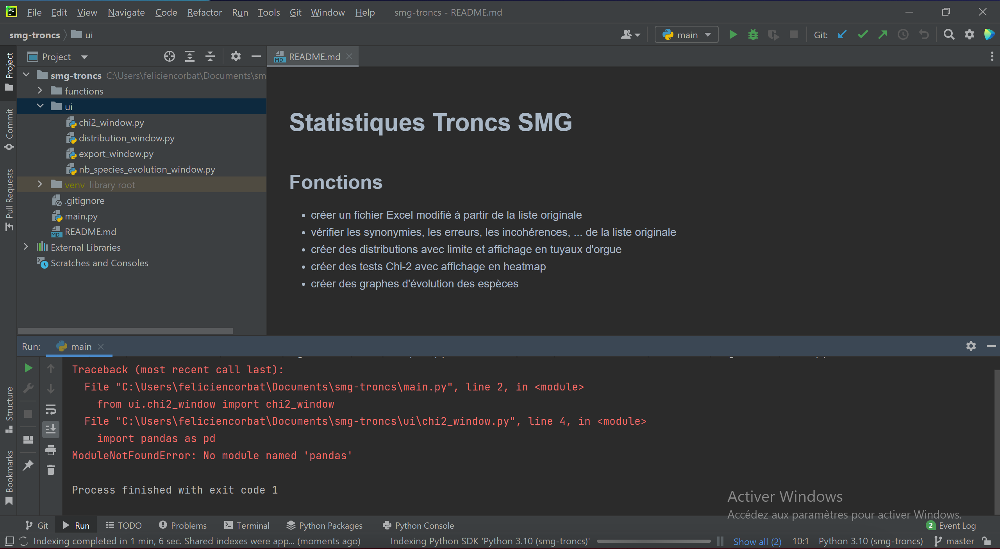
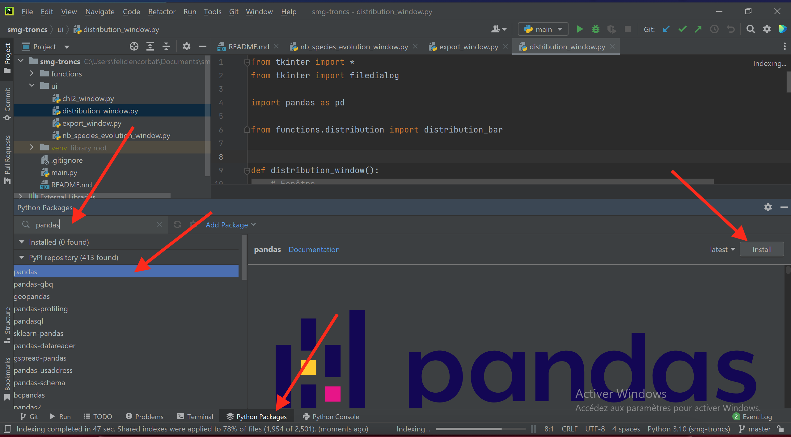
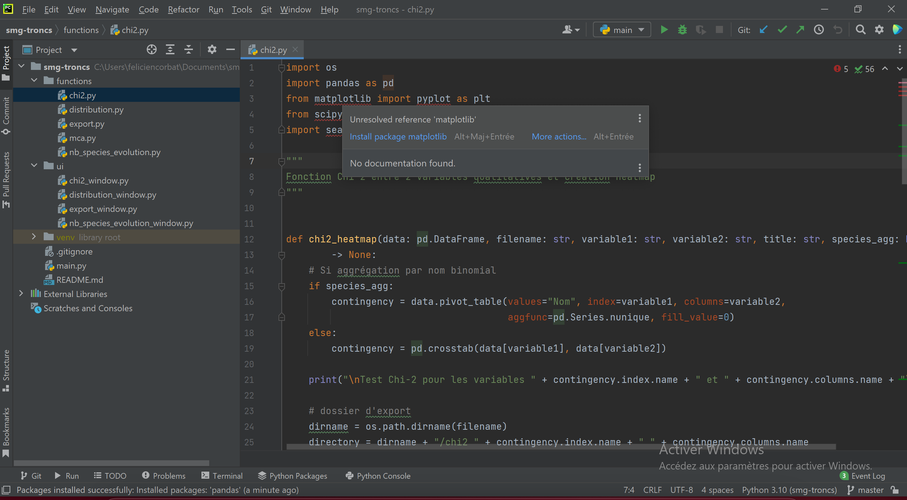

# Statistiques Troncs SMG

## Fonctions

- créer un fichier Excel modifié à partir de la liste originale
- vérifier les synonymies, les erreurs, les incohérences, ... de la liste originale
- créer des distributions avec limite et affichage en tuyaux d'orgue
- créer des tests Chi-2 avec affichage en heatmap
- créer des graphes d'évolution des espèces

## Installation

### Installer Python

Télécharger et installer Python à l'adresse: https://www.python.org/downloads/

Ne pas oublier de cocher "Add Python 3.x to PATH"

### Installer PyCharm

Télécharger et installer PyCharm à l'adresse: https://www.jetbrains.com/fr-fr/pycharm/download/

Il faut choisir la version Community (gratuite et open source)

### Ajouter le dépôt Github à PyCharm

Au lancement de PyCharm, vous obtenez cette fenêtre:

(si cette fenêtre n'est pas affichée, choisir le menu "Git" -> "Clone...")

Cliquer le bouton "Get from VCS"

Si Git n'est pas installé, cliquer "Download and Install"

Dans le champ URL, ajouter: https://github.com/feliciencorbat/smg-troncs.git

Dans le champ Directory, choisir où ajouter les fichiers (par exemple dans le dossier Documents)

Enfin, cliquer sur "Clone"

Tous les fichiers du projet sont ajoutés au dossier et affichés dans PyCharm

### Lier Python au projet

Sur le bouton "IDE and Project Settings", sélectionner "Preferences..."

Se rendre sur "Project: smg-troncs" -> "Python Interpreter"

Cliquer sur le bouton "Settings" et choisir "Add..."

Sélectionner "Virtualenv Environment"

Dans "Location", choisir le lieu où se trouvera l'environnement virtuel
Laisser par défaut dans le dossier du projet

Cliquer "OK"

Votre environnement virtuel avec Python est installé.

### Indiquer où se trouve le fichier de lancement

Cliquer sur le bouton "Add Configuration..."

Cliquer sur "+" et choisir "Python"

Dans le champ "Script path:", sélectionner le fichier "main.py" de votre projet

Dans le champ "Python interpreter:", l'interpréteur Python créé précédemment devrait automatiquement être ajouté, sinon le sélectionner.

Cliquer "OK"

### Ajouter les librairies

En lançant l'application en cliquant sur le triangle vert "Run 'main'", des erreurs seront affichées car des librairies manquent. Dans le message en rouge, il est indiqué qu'il manque le module 'pandas'.

Une solution pour installer les librairies est d'aller dans l'onglet "Python Packages".
Dans le champ "Search for more packages", écrire "pandas"
Sélectionner "pandas" et cliquer sur le bouton "Install".

Il faut réaliser l'opération jusqu'à ce que toutes les librairies soient installées.

L'autre solution est de naviguer dans les fichiers (le dossier "functions" en particulier). Une fois que le projet est indexé (ce qui peut prendre un peu de temps) par PyCharm, les librairies non installées sont surlignée en rouge. En les survolant, il est proposé de les installer ("install package matplotlib" par exemple)